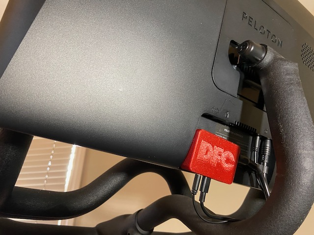

# DFC Getting Started Guide

## Connection to your bike

DFC has two jacks on it — like the kind you plug headphones into. You'll unplug the data cable from the back of the bike's tablet and put that in one jack. Then connect another provided cable from DFC into the back of the tablet. This is shown below. 

It's really simple and no cable-cutting or permanent modifications to the bike are necessary.

After that you connect it to the platform you want (e.g. Zwift, Garmin) and it works just like a Bluetooth power meter and speed sensor.

## Connection to fitness devices 

The details here are for Garmin devices but others will be similar. Once you do the initial pairing the Garmin device will connect automatically every time you start a ride. You just go to start Indoor Cycling on your watch and it all shows up.

The Garmin device will start recording (if you want) before the class starts as long as the power/watts are displayed on the Peloton screen. Then, when the class is over, you can keep going with a cool down and the Garmin will keep recording your data. Another thing you can do is string a few Peloton classes together and have them show up as one workout on the Garmin.