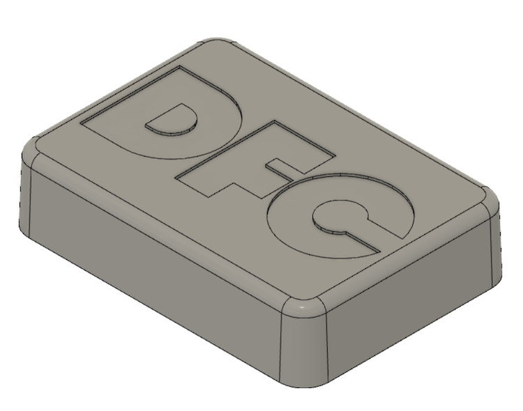
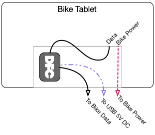
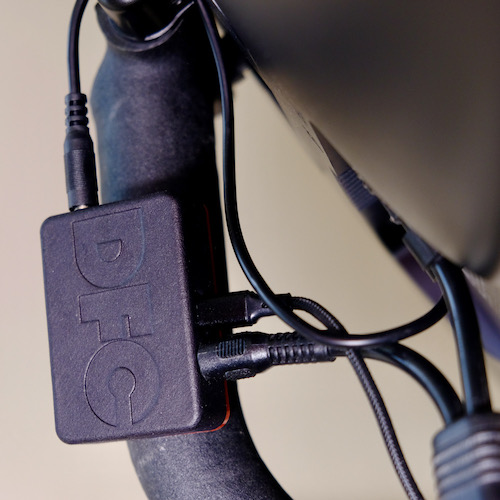
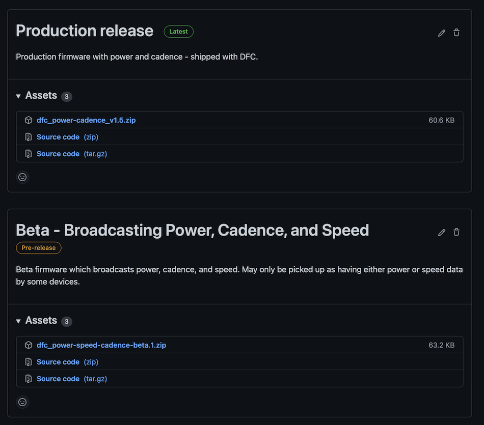
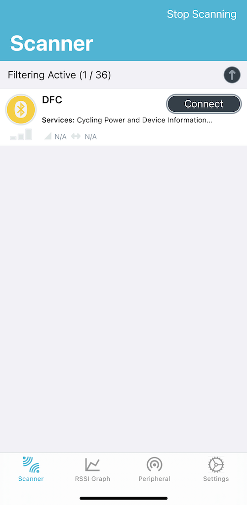
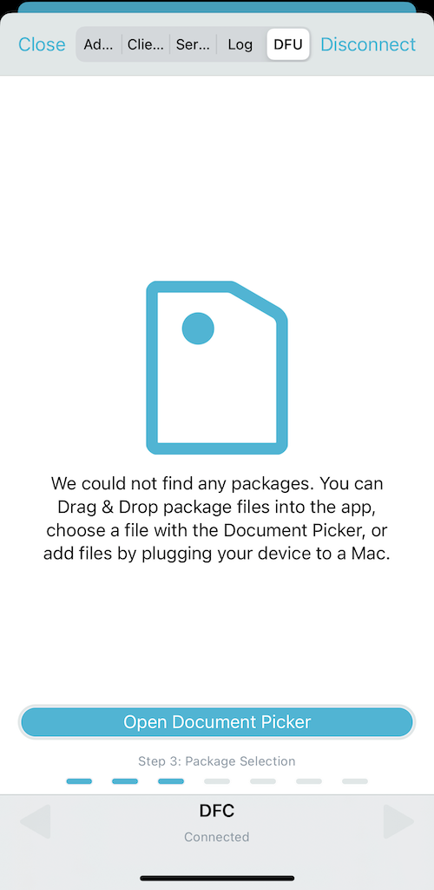
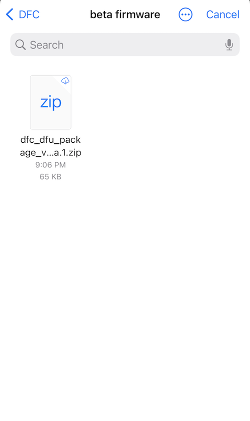
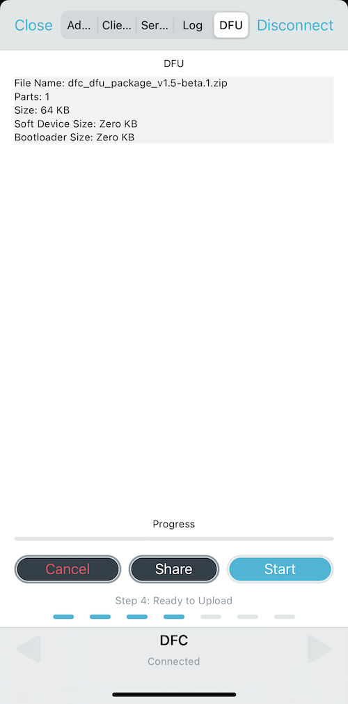
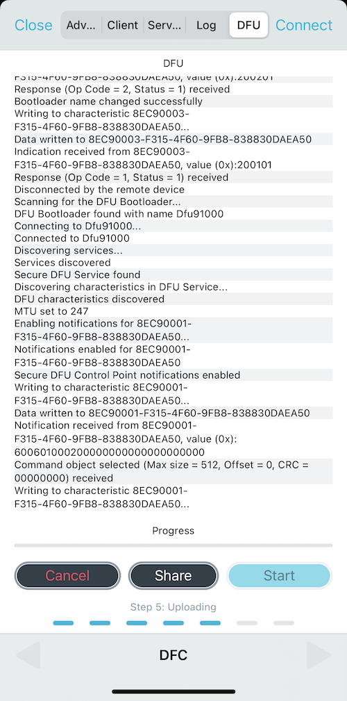
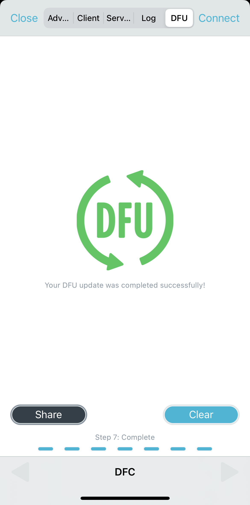

# DFC User Guide

# Features

DFC allows the Peloton Bike to communicate with fitness watches, head units, and apps — a feature that’s not available on the stock Bike. It reads power and cadence data in real-time, through a cable connected to your bike, and broadcasts them wirelessly to nearby devices including those built around platforms like Zwift and Garmin. This lets you enjoy the built-in functionality of your bike while simultaneously utilizing features and services that depend on third-party platforms.

* Supports two simultaneous wireless connections for connecting to both a wearable and app at the same time
* Wireless device firmware updates for future upgrades
* Open and expandable platform for adding new features down the line

# Connecting DFC to your bike

Hooking up DFC only takes a few minutes to get going and no cable-cutting or permanent modifications to the bike or tablet are necessary. Refer to the connection diagram for these steps.

1. Disconnect the data cable from the back of the tablet and plug it into either jack on DFC.
    1.  Two cables are on the back of the tablet – the one on the left is the data cable and the one on the right is the power cable. 
    2.  The data cable and power cable are held to the back of the tablet by a clasp that must be disengaged prior to removing the data cable.
    3.  DFC has two jacks that look similar to the ones you might use to plug in headphones, plug the data cable into either one.
2. Connect the provided short data cable between DFC and the data connection on the back of the tablet. Either data jack on DFC can be used for this connection.
3. Connect the provided long USB power cable to DFC.
    1. Either of the two USB-C ports on DFC can be used for this connection.
4. Connect the provided long USB power cable to a USB charging outlet. A USB charging outlet is not provided but most standard USB chargers such as those used to charge phones and other devices should work. 
    1.  NOTE: DFC must be powered with a USB-C to USB-A cable such as the one provided. It is not supported to work with a USB-C to USB-C cable.
    2.  DFC has two USB ports but only one is to be connected at a time. The multiple ports allow flexibility in placement and cable routing as well as future expansion options.
5. Recommended: Attach DFC to the back of your tablet with mounting tape or mounting putty. Use zip-ties to run the DFC power cable along the path of your bike's power cable for a clean look.
6. **Note: Make sure all the cables are pushed in fully before proceeding.**

# Connecting to DFC with your device or app

1. Follow the directions from your specific application or device for pairing a sensor. See the [Compatibility Tables](#compatibility-table) for apps and devices that are known to work, or not, with DFC.
    1. DFC acts as a power meter and cadence sensor and will show up in the pairing screen or sensors section of the application/device you are connecting to. 
    2. For example, in Zwift in the Paired Devices menu: (1) click Power Source and select DFC, then (2) click Cadence and select DFC.
    3. For example, on a Garmin cycling computer or Fenix watch go to Settings > Sensor > Add Sensor and you will see DFC show up as a power sensor. Once selected your device will also read cadence from DFC with no additional setup required.
2. Once you do the initial pairing your device will connect to DFC automatically every time you start a ride.
3. Note: DFC only receives data when live power data is shown on the tablet screen. 
    1. Your connected device can start recording data before the class starts as long as the power/watts are displayed on the tablet screen. This allows you to string a few classes together and have them show up as one workout on your device.

# Troubleshooting

* DFC is not showing up on my device or app's pairing screen.
    * Verify that DFC is powered on. It will blink for the first three minutes it’s powered on. 
* DFC is connected to my device or app but not showing any power data on my connected device.
    * Verify that all connections on DFC and your tablet are tight.
    * Verify that the screen on your tablet shows your power and other metrics. Your tablet must be in a class or set to a scenic or self-paced ride for DFC to receive data. 
* DFC is connected to my device or app but the tablet screen does not show any power data.
    * Verify that all connections on DFC and your tablet are tight.
    * Check the tablet screen for messages stating that there are loose connections. If so, recheck all connections. If there are no messages on the tablet screen then exit and restart the class you were doing.

# Compatibility Tables

Most modern devices and apps that support reading power data *should* work with DFC. Please note that DFC is not compatible with legacy devices that only support the the ANT+ protocol such as the Garmin Fenix 5 and Wahoo Roam v1 (2019). 

These tables are updated to show whether something is known to work with DFC (or not).

## Devices

| Manufacturer | Model                      | Type             | Power & Cadence | Speed & Cadence Only Beta | Notes                                                                                                                                                             |
| ------------ | -------------------------- | ---------------- | --------------- | ------------------------- | ----------------------------------------------------------------------------------------------------------------------------------------------------------------- |
| Garmin       | Fenix 6X, 6 Pro, 6 Saffire | Watch            | Yes             | Yes                       |                                                                                                                                                                   |
| Garmin       | Fenix 6, Fenix 6S          | Watch            | Yes*            |                           | *Dropouts were causing issues with the base Fenix 6 models. [This update](https://github.com/intelligenate/dfc/releases/tag/power-cadence-beta.3) fixes it. See the [Firmware Updates](#firmware-updates) section below for details on updating.* |
| Garmin       | Fenix 5X                   | Watch            | Yes             |                           |                                                                                                                                                                   |
| Garmin       | Marq                       | Watch            | Yes             |                           |                                                                                                                                                                   |
| Garmin       | FR945                      | Watch            | Yes             |                           |                                                                                                                                                                   |
| Polar        | Grit X, Vantage            | Watch            | Yes             |                           |                                                                                                                                                                   |
| Cronos       | Pace                       | Watch            | Yes             |                           |                                                                                                                                                                   |
| Garmin       | Venu, Insight              | Watch            | No              |                           | These watches do not support reading power data from *any* manufacturer but speed and cadence should work                                                         |
| Garmin       | Vivoactive 4               | Watch            | No              | Yes                       | These watches do not support reading power data from *any* manufacturer but speed and cadence should work                                                         |
| Garmin       | FR645, FR245               | Watch            | No              |                           | These watches do not support reading power data from *any* manufacturer but speed and cadence should work                                                         |
| Garmin       | 735XT, Fenix 3             | Watch            | No              |                           | These watches only support the ANT+ wireless protocol which is not compatible with DFC                                                                     |
| Garmin       | Edge 130, 530, 830         | Cycling Computer | Yes             | Yes                       |                                                                                                                                                                   |
| Stages Dash  | M50, L50                   | Cycling Computer | Yes             | Yes                       |                                                                                                                                                                   |
| Wahoo        | Roam v2 (2022)             | Cycling Computer | Yes             | Yes                       |                                                                                                                                                                   |
| Wahoo        | Roam v1 (2019)             | Cycling Computer | No              | No                        | This device only supports the ANT+ wireless protocol which is not compatible with DFC                                                                    |
## Apps

| Application | Power & Cadence | Notes |
| ----------- | --------------- | ----- |
| Zwift       | Yes             |       |
| TrainerRoad | Yes             |       |
| Sufferfest  | Yes             |       |
| Kinomap     | Yes             |       |
| Wahoo       | Yes             |       |
| ROUVY       | Yes             |       |

# Firmware Updates

Firmware updates are [located here](https://github.com/intelligenate/dfc/releases). To update the firmware or try out a beta release follow these steps.

1. Download the nRF Connect for Mobile app [from here](https://www.nordicsemi.com/Products/Development-tools/nRF-Connect-for-mobile). 
    * nRF Connect is a third-party app developed by the maker of the wireless chipset used in DFC. It allows you to perform wireless firmware updates on DFC.

2. Download the firmware you want to install [from here](https://github.com/intelligenate/dfc/releases). 

    * Firmware releases are packaged as zip files. The latest, most compatible, releases are marked "Latest".

    * Releases marked "Pre-release" contain new features that may or may not work with some devices. 

    * If the new features on a pre-release build don't work with your device you can always go back to a stable release by downloading and installing the release marked "Latest".

    

3. Connect to DFC with nRF Connect.

    

4. Once connected go to the DFU tab on the top.

    
    
5. Click Open Document Picker and select the firmware file downloaded earlier [from here](https://github.com/intelligenate/dfc/releases).

    

6. After the file is loaded press Start to upload it to DFC.

    

7. As it's uploading you'll see a bunch of text on the screen. You can safely ignore this text.

    

8. After the update is completed you'll see the image below and can close nRF Connect.

    

# Upcoming Features

## Addition of speed sensor capability

We have a prototype of this working but testing with several fitness devices revealed some undesired behavior. Some devices only pick up either power data or speed data but not both.  We're working on this and will include an update once we get it working consistently across devices.

Adventurous users are welcome to try out the [beta releases here](https://github.com/intelligenate/dfc/releases). If you do so please report back what device you used and whether all the features worked. See the [Firmware Updates](#firmware-updates) section for details on how to update the firmware. After trying a beta release you can always revert back to the production release.

# FAQs

## Can I power DFC with the micro-USB connector on the back of the tablet?

While most USB-C to micro-USB cables don't allow for power going in that direction some users report that USB-OTG cables [such as this one](https://www.amazon.com/dp/B07KP6NTK7) may work. Additionally others have had success with using an [adapter like this](https://www.amazon.com/dp/B01LYYAOIE/) to plug into the back of the tablet, then use the cable that came with DFC to plug into that adapter. For those in Europe [this adapter](https://www.amazon.de/dp/B0BKPZD24M) has also been reported to work.

Down the road another option is that DFC can run on a coin cell battery but it's not optimized for that yet. It only lasts for a couple days instead of a few months so it's not advised to try it until it's working well. That would allow for a cleaner connection and no additional cord to run.

## Does DFC work with the Bike+?

DFC was designed to be compatible with the original Peloton Bike and is only supported for use with that model. Initial testing with the Bike+ has found that it's going to be infeasible at this time to support it.

# Notice

DFC is a product of Intelligenate, LLC and is designed and assembled in USA.

DFC is not affiliated with Peloton Interactive, Zwift, Garmin or any other company mentioned here. All trademarks are the property of their respective owners.

This user guide is released with a [CC BY-SA license](https://creativecommons.org/licenses/by-sa/4.0/).  

# Warnings, Regulatory Compliance, and Safety Information

## WARNINGS

* This product shall only be connected to an external USB power supply rated at 5-20V DC. Any external power supply used with DFC shall comply with relevant regulations and standards applicable in the country of intended use.
* In testing DFC no adverse incidents, to equipment or otherwise, connected to its use have been observed. In no event shall Intelligenate, LLC be liable for any direct, indirect, punitive, incidental, special consequential damages, to property or life, whatsoever arising out of or connected with the use or misuse of our products.

## INSTRUCTIONS FOR SAFE USE

To avoid malfunction or damage to your DFC please observe the following:
* Do not expose it to water or moisture while in operation.
* Take care while handling to avoid mechanical or electrical damage to the printed circuit board and connectors.

## COMPLIANCE INFORMATION

DFC complies with the relevant provisions of the European RoHS Directive 2011/65/EU, 2015/863/EU and Radio Equipment Directive (RED) 2014/53/EU. In common with all Electronic and Electrical products DFC should not be disposed of in household waste. Alternative arrangements may apply in other jurisdictions.

## FCC Statement

This device complies with part 15 of the FCC Rules. Operation is subject to the following two conditions: (1) This device may not cause harmful interference, and (2) this device must accept any interference received, including interference that may cause undesired operation.

## ISED Statement

This device complies with Industry Canada license exempt RSS standard(s). Operation is subject to the following two conditions: (1) this device may not cause interference, and (2) this device must accept any interference, including interference that may cause undesired operation of the device. 
Le présent appareil est conforme aux CNR d'Industrie Canada applicables aux appareils radio exempts de licence. L'exploitation est autorisée aux deux conditions suivantes: (1) l'appareil ne doit pas produire de brouillage, et (2) l'utilisateur de l'appareil doit accepter tout brouillage radioélectrique subi, même si le brouillage est susceptible d'en compromettre le fonctionnement. 

# SICHERHEITSANWEISUNGEN 

## WARNUNGEN UND HINWEISE 

* Dieses Produkt darf nur an eine externe Stromquelle mit einer Nennspannung von 5-20 V Gleichstrom. Alle mit dem DFC verwendeten externen Stromquellen müssen den betreffenden Vorschriften und Regelwerken des Nutzungslandes entsprechen. 
* Beim Testen von DFC wurden keine nachteiligen Vorkommnisse an Geräten oder auf andere Weise im Zusammenhang mit seiner Verwendung beobachtet. In keinem Fall haftet Intelligenate, LLC für direkte, indirekte, strafrechtliche, zufällige oder besondere Folgeschäden an Eigentum oder Leben, die sich aus oder im Zusammenhang mit der Verwendung oder dem Missbrauch unserer Produkte ergeben.

# RICHTLINIEN FÜR DEN SICHEREN GEBRAUCH 

Bitte halten Sie sich an die folgenden Anweisungen, um Fehlfunktionen oder Schäden an Ihrem DFC zu vermeiden: 
•   Setzen Sie das Gerät nie Wasser oder Feuchtigkeit aus und setzen Sie es nicht auf einer leitenden Oberfläche ab, während es in Betrieb ist. 
•   Seien Sie bei der Arbeit mit dem Gerät und dessen Handhabung vorsichtig, um mechanische oder elektrische Schäden an der Leiterplatte und an den Anschlüssen zu vermeiden. 

## COMPLIANCE-INFORMATIONEN

Das DFC entspricht den relevanten Bestimmungen für die europäische Union RoHS Directive 2011/65/EU, 2015/863/EU & Radio Equipment Directive (RED) 2014/53/EU. Wie alle anderen Elektro- und Elektronikprodukte (EEE) auch, darf das DFC nicht als Hausmüll entsorgt werden. In anderen Gesetzgebungen können alternative Regelungen gültig sein.

