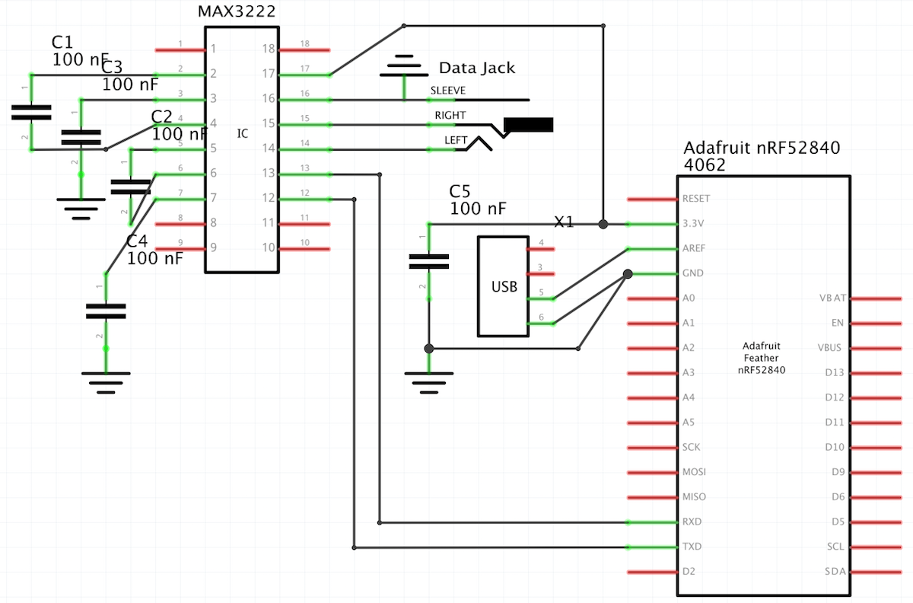
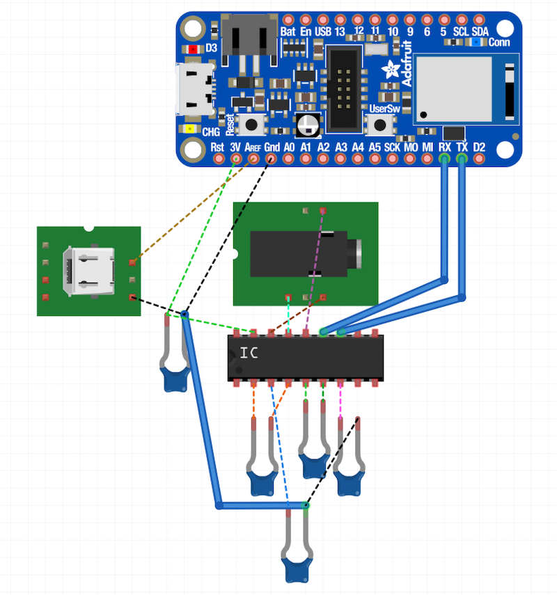

# IrieTron 3030 Arduino Notes

The IrieTron 3030 Arduino file is what the initial development of DFC was done with. It is made to use with the Adafruit Bluefruit Feather board with a MAX3222 RS-232 driver/receiver IC on a FeatherWing. The Arduino version is no longer in active development and is provided to others who may want to make their own data broadcaster.

# Schematic

# Bill of Materials

| Part                              | Quantity |
| --------------------------------- | -------- |
| 100nF Capacitor                   | 5        |
| Adafruit Bluefruit Feather        | 1        |
| 3.5mm Jack                        | 1        |
| USB Connector                     | 1        |
| MAX3222 RS-232 driver/receiver IC | 1        |